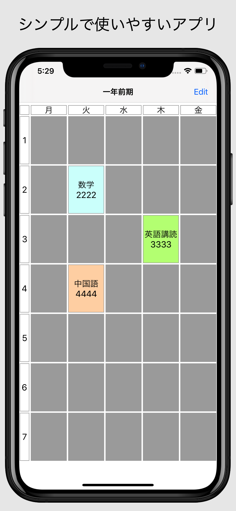
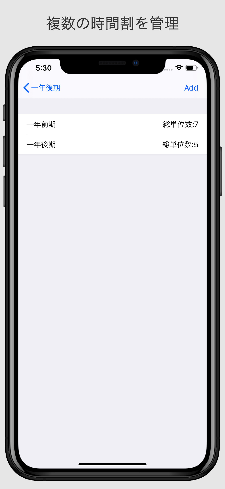
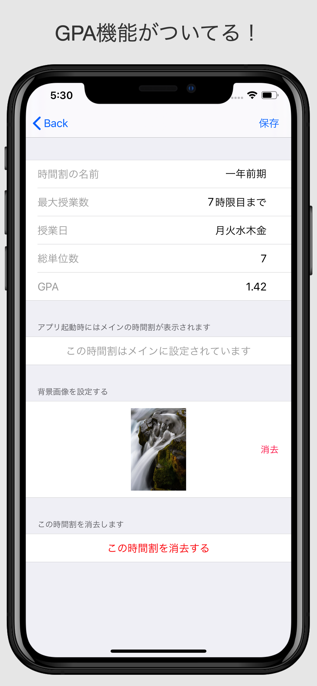
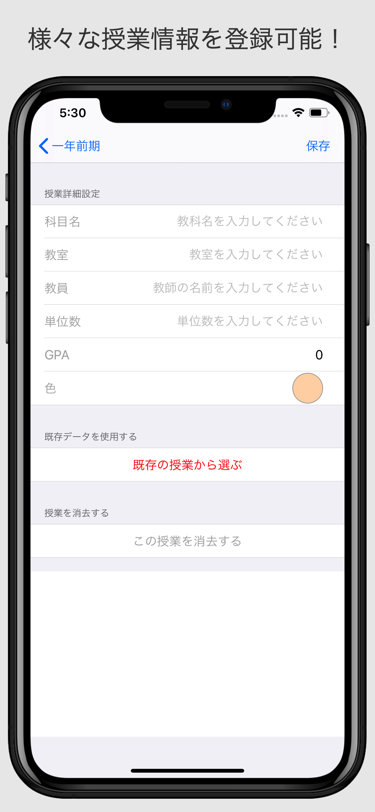
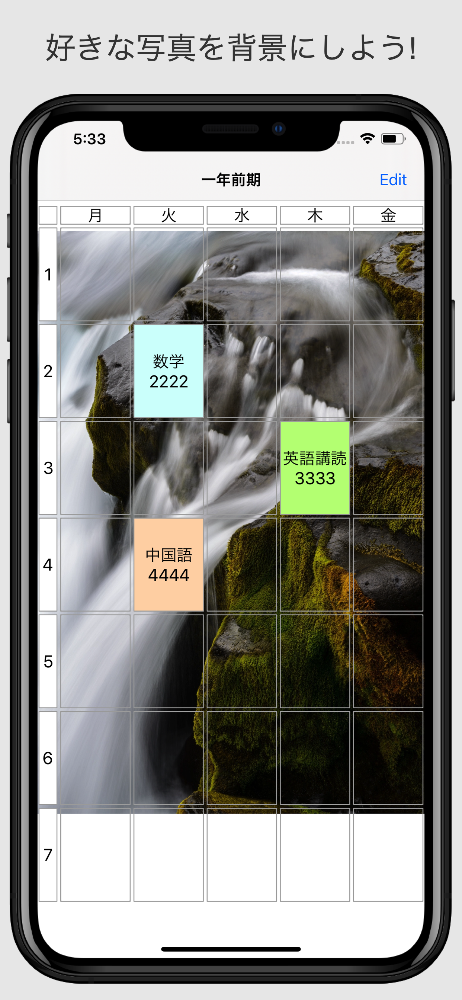
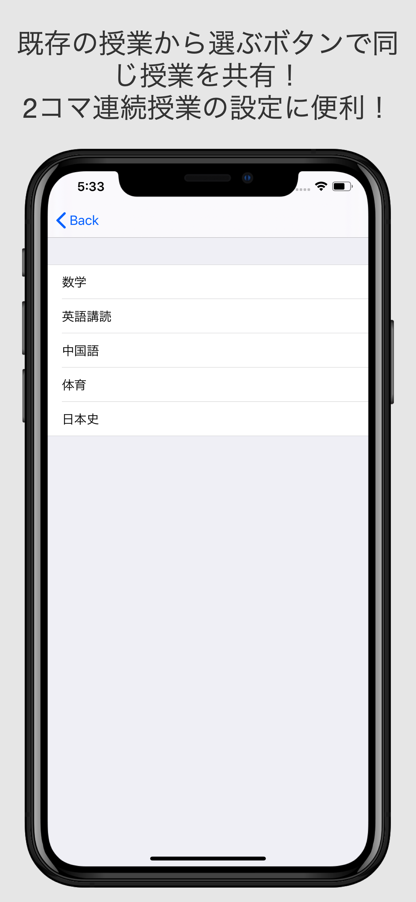

# 時間割アプリ

### GPA自動計算機能
登録した授業にGPAを入れ込むと各時間割のGPAを自動算出します

### 授業共有機能
通年授業を前期の時間割と後期の時間割に2回登録するのめんどくさいから共有できるようにしました。

<table>
<tr>
<td></td>
<td></td>
<td></td>
<td></td>
<td></td>
<td></td>
</tr>
</table>

[AppStore](https://apps.apple.com/jp/app/時間割-gpa計算機能付き/id1511126473)にあげてます
